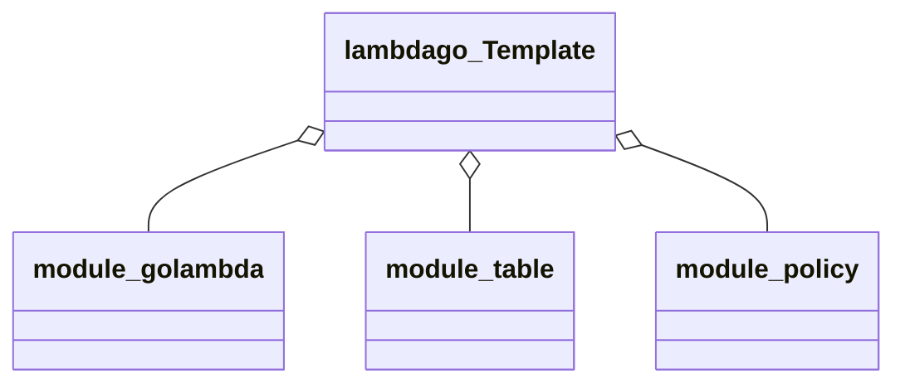

# Deploy Lambda with CloudFormation Modules




## Step 1 deploy modules

```bash
task deploy-module-lambda
task deploy-module-policy
task deploy-module-table
```

## Step 2 create lamba code

Inside directory "lambda"

1) Set a Bucket name.
2) Deploy zip on bucket:

    ```bash
    task s3deploy
    ```

## Step 3 create cloudformation

Inside main directory

1) Update stackname in `parms.json`

2) Deploy stack
    ```bash
    task deploy-stack
    ```


