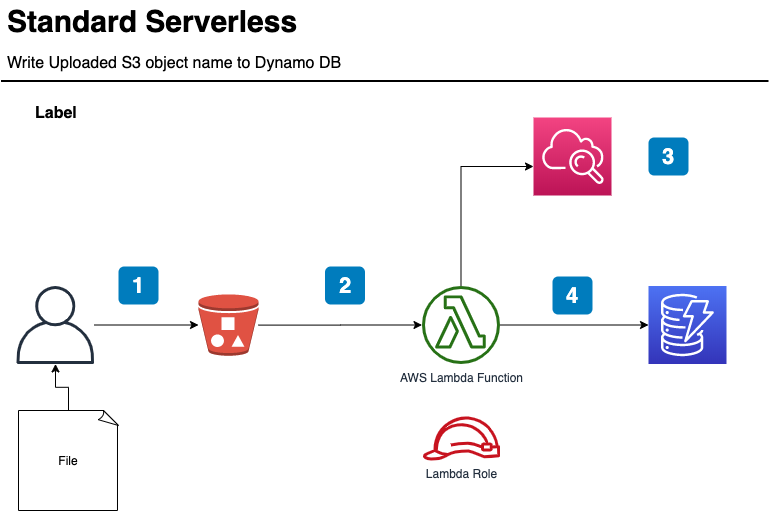

# Standard Serverless - Overview

There are many interesting serverless usercases out there, e.g. [AWS Reference Architectures](https://aws.amazon.com/lambda/resources/reference-architectures/).

We kept his architecture deliberately simple so that you can experiment with the tools.

## Implementations (tbd)

## Use Case description

1) User uploads object to S3 bucket
2) Bucket upload event goes to lambda
3) Lambda writes object name with timestamp to dynamoDB

The implementations should keep an eye on:

- How to update architecture and lambda Code
- How to support local testing
- How to update Lambda Code fast
- How to support least privileges
    - The Lambda Role should only give access rights to this very dynamoDB