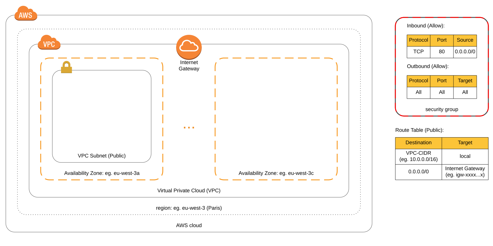

# Simple Network - Overview

- [Simple Network - Overview](#simple-network---overview)
- [Use Case Description](#use-case-description)

Quicklinks to the sources for each benchmarked infrastructure as code framework:

- [Terraform](./terraform)
- [pulumi - TypeScript](./pulumi)
- [GoFormation](./goformation)
- [AWS CDK](./cdk)

# Use Case Description

This use case should represent the setup of a basic network configuration on AWS. This network configuration includes the following resources:

- Virtual Private Cloud (VPC) in a user specified region
- Subnet in a user specified availability zone (default: availability zone a)
- Internet Gateway attached to the VPC
- Route Table with a public route (all unspecified traffic is send to the Internet Gateway)
- Security Group (Webserver: Inbound Port 80, Outbund All)

The setup identified can be seen in the infrastrucutre diagram below.

> Note: The setup does not represent a whole production ready network setup regarding high availability, workload distribution/isolation, etc. for which more subnets should be incorporated.  
> But these snippets might be used to create your own infrastructure as code templates.